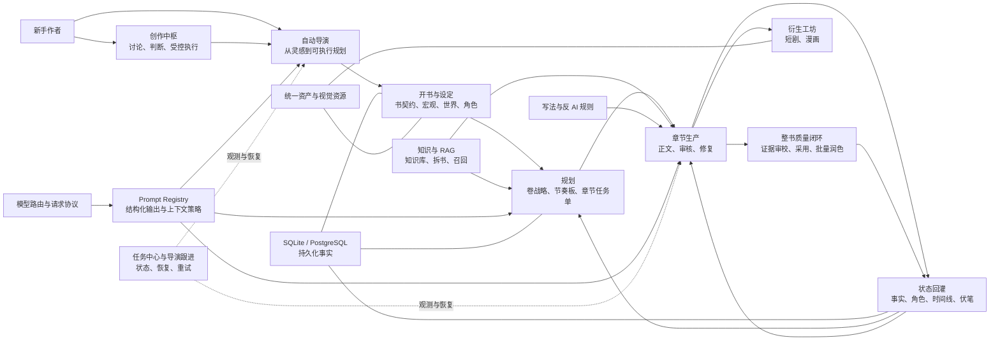
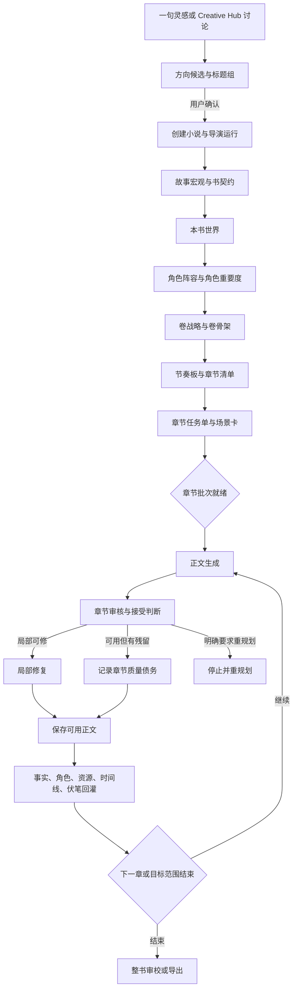

# 项目知识图谱

## 这是什么

本目录是当前项目的问答导航层。它不复制全部公开文档、Wiki 和源码，而是把“用户问题、产品能力、运行链路、长期资产、代码所有者、文档证据、来源边界”连成一张可追踪的图。

以后在 Codex 中询问本项目时，先从本页判断问题属于哪条链，再读取对应专题页和源码。回答应以当前代码和运行数据为事实源，以 Wiki 解释稳定规则，以公开文档解释用户操作，不应只凭 README 或历史计划推断现状。

本图在 2026-07-20 以以下状态核对：

- 官方公开文档：<https://explosivecoderflome.github.io/AI-Novel-Writing-Assistant/docs>
- 官方主线：`4f4def1d`（当前仓库 `origin/main`）
- 定制业务基线：`31ca22c2`（知识图谱提交前的 `novel-custom`）
- 定制业务基线相对官方主线：15 个提交、102 个文件、3495 行新增、93 行删除

版本和分支来源细节见[来源与定制边界](./provenance.md)。

## 如何使用

1. 想知道“这个项目能做什么”：读[能力目录](./capability-catalog.md)。
2. 想知道“某个流程为什么卡住、状态在哪里”：读[问题路由](./question-routing.md)，再进入对应 workflow 或 debugging 页面。
3. 想知道“功能来自官方还是定制分支”：读[来源与定制边界](./provenance.md)。
4. 想理解整套系统：先看下方总图，再读[项目总手册](../project-handbook.md)。
5. 想改代码：从能力目录定位前端入口、服务端所有者、持久化资产和约束文档，确认边界后再编辑。

## 全局关系图

## 小说生产主链

必须保留的质量边界：单章局部质量问题应进入修复或质量债务，不能自动阻断全书链；只有结构化结果明确要求 `replan`、没有可用正文的不可恢复失败，或运行时安全/数据完整性问题才能停止全局任务。

## 知识节点分层

| 层级 | 回答什么 | 首选证据 |
| --- | --- | --- |
| 用户操作层 | 页面在哪里、应该点什么、下一步是什么 | `docs/public/`、当前前端路由和 UI |
| 产品规则层 | 为什么这样设计、面向谁、哪些默认值优先 | `docs/wiki/product/`、`AGENTS.md` |
| 工作流层 | 阶段如何流转、何时暂停、如何恢复 | `docs/wiki/workflows/`、任务与 runtime 代码 |
| AI 治理层 | Prompt、结构化输出、上下文和模型如何协作 | `docs/wiki/prompts/`、`server/src/prompting/`、`server/src/llm/` |
| 数据事实层 | 哪些信息落库、谁是事实源、状态是否真的完成 | Prisma schema、数据库记录、服务端 projection |
| 架构层 | 模块归属、依赖方向、接口入口 | `docs/wiki/architecture/`、`server/src/modules/`、稳定 facade |
| 来源层 | 官方、定制、历史移植或未知来源 | Git 提交关系、[来源与定制边界](./provenance.md)、许可证文件 |

## 回答项目问题时的证据顺序

1. 当前源码、schema、路由和实际运行状态。
2. 对应的稳定 Wiki 规则。
3. 当前公开文档与项目总手册。
4. 设计文档、检查点和仍有效的计划。
5. Release notes 和 Git 历史用于解释来源与演进，不替代当前行为。
6. 归档计划只作为历史背景，不能证明功能仍存在。

如果文档与代码冲突，应明确说出冲突并以代码事实为准；如果只能确认“计划过”而不能确认“已实现”，必须标记为待核实，不能把计划写成现状。

## 核心事实源

| 主题 | 事实源 | 解释入口 |
| --- | --- | --- |
| 产品入口 | `client/src/router/index.tsx` | `docs/public/modules/` |
| 服务端 API | `server/src/app.ts`、模块 `http/` | [模块边界](../architecture/module-boundaries.md) |
| 小说主链 | `server/src/modules/novel/`、`server/src/services/novel/` | [章节生产链](../workflows/chapter-production-chain.md) |
| 自动导演 | `server/src/services/novel/director/` | [自动导演 Runtime](../workflows/auto-director-runtime.md) |
| Prompt | `server/src/prompting/registry.ts`、`prompts/` | [Prompt Registry](../prompts/prompt-registry-and-structured-output.md) |
| 模型协议 | `server/src/llm/` | [LLM 请求协议](../architecture/llm-request-protocols.md) |
| 持久化 | `server/src/prisma/schema.sqlite.prisma`、`schema.prisma` | 各 workflow 的状态合同 |
| RAG | `server/src/services/knowledge/`、`services/rag/` | [知识与上下文组装](../rag/knowledge-and-context-assembly.md) |
| 任务状态 | `server/src/services/task/`、导演 projection | [任务中心职责](../product/task-center-role.md) |
| 定制差异 | `git diff origin/main...novel-custom` | [来源与定制边界](./provenance.md) |

## 维护规则

- 新增或删除用户入口时，更新能力目录。
- 修改自动导演、章节生产、恢复、Prompt、RAG、模型协议或任务投影时，更新对应 Wiki，并检查本图中的边是否仍成立。
- 上游同步到 `novel-custom` 后，重新核对官方主线 commit、定制提交数和定制能力清单。
- 引入第三方代码或功能时，记录仓库 URL、版本/commit、许可证、落地模块和后续所有者；只有计划名称或分支名称不能作为外部来源证明。
- 不把临时 TODO、每次提交的文件列表和发布流水账放进知识图谱。
- 同一个事实只在一个专题页详细解释；本目录负责导航和关系，不复制整段实现说明。
