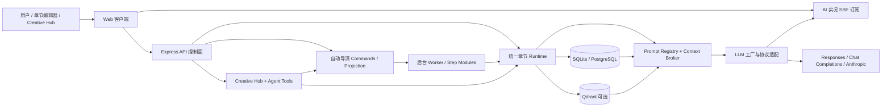

# AI 小说创作工作台项目总手册

## 1. 这份手册解决什么问题

这是一份面向使用者、维护者和 AI Agent 的总入口。它回答四类问题：

- 产品到底能做什么，哪些能力是真正落库并可持续复用的；
- 如何与 AI 讨论创意，又如何指定某章、某段让 AI 修改；
- 自动几十章、几百章乃至百万字长篇时，系统怎样保存上下文和恢复进度；
- 出现问题时应该看哪个页面、哪条任务、哪段代码，而不是盲目重跑。

阅读原则：产品能力以当前代码、数据库资产和任务状态为准；README、公开文档和本手册用于解释，不替代运行事实。

未来在 Codex 或网页版询问本项目时，可以先让 AI 阅读本文件，再按“代码地图”进入具体实现。涉及协议时同时阅读 [LLM 请求协议、厂商配置与探针规则](./architecture/llm-request-protocols.md)。

## 2. 结论先行：它是否满足 AI 自动写小说需求

| 需求 | 当前支持 | 正确理解 |
| --- | --- | --- |
| OpenAI、Qwen、Kimi 等 BaseURL + Key 接入 | 是 | 内置厂商和自定义厂商均可；自定义服务优先走 OpenAI-compatible 目录与文本接口 |
| Responses API | 是 | 可显式固定 `/responses`，同时保留 Chat Completions 和 Anthropic |
| 自动获取模型名称 | 是 | 读取 `GET {BaseURL}/models` 的 `data[].id`；失败时可手填 |
| 与 AI 讨论创意、世界和角色 | 是 | Creative Hub 负责讨论和受控工具调用，正式设定需写入小说/世界/角色资产 |
| 指定某章让 AI 修改 | 是 | 章节编辑器支持整章或选区、自然语言要求、候选对比、快照和应用 |
| 在 Creative Hub 点名章节修改 | 是 | 可按章节序号读取、预览 diff，并经审批应用章节补丁 |
| 自动设计伏笔并跟踪兑现 | 是 | 故事宏观、卷/章规划、状态快照与 payoff ledger 共同管理 |
| 查看 AI 当前在做什么 | 是 | 顶部“AI 实况”展示生成、校验和修复过程；正式保存结果仍以任务和资产状态为准 |
| 与角色讨论其选择 | 是 | 小说角色可基于正史和主观思路线对话；经作者确认的影响只作为后续有限章节的软引导 |
| 整书审校与批量润色 | 是 | 审校先形成带章节证据的报告；建议经采用后进入后续约束，润色复用可恢复的章节生产链 |
| 统一管理创作与视觉资产 | 是 | 统一资产中心负责文字资产入口，视觉资源库聚合可复用图片；各资产仍由原业务模块维护 |
| 自动几十或几百章 | 是 | 可按全书、卷或章节范围执行；每章保存、审核、回灌后再进入下一章 |
| 百万字长篇 | 架构上支持 | 不是把百万字塞进一次 Prompt；依赖分层规划、状态账本、摘要、RAG、分批执行和恢复 |
| 从头到尾必须一直聊天 | 否，也不应如此 | 先讨论和确认方向，之后可后台自动化；命中检查点或用户想改动时再介入 |

“支持”不等于任意模型、任意额度、任意网关都能无故障跑完。长任务会受模型上下文、输出长度、服务稳定性、费用、质量闸和数据一致性约束。

## 3. 推荐的实际使用方式

### 3.1 第一次配置

1. 打开“系统设置”，配置一个厂商。
2. 填写 API Key、BaseURL、默认模型和文本请求协议。
3. 能获取模型列表时先获取；不能获取时手动填模型 id。
4. 点击连接测试，确认普通与结构化能力均通过。
5. 进入“模型路由”，先让所有任务使用同一个已验证模型。
6. 用 1～3 章测试项目验证创意、规划、正文、审核与保存。
7. 验证后再扩大到一卷、几十章或整本。

这不是因为系统只能写短篇，而是用最小成本验证网关协议、模型结构化能力、输出长度和中文正文质量。

### 3.2 从创意讨论到正式开书

推荐路径：

```text
Creative Hub 讨论想法
  -> 自动导演生成多套书级方向与标题
  -> 用户选择/定向重做
  -> 故事宏观与书契约
  -> 本书世界与角色阵容
  -> 卷战略、节奏板、章节清单、章节任务单
  -> 章节执行、审核、修复、状态回灌
```

Creative Hub 可讨论：

- 核心创意、题材、目标读者、卖点和情绪承诺；
- 世界规则、势力、地点、冲突来源和限制；
- 主角欲望、成长路径、反派压力、角色关系和秘密；
- 故事宏观、卷使命、关键爆点、悬念盒和结局方向；
- 某章为什么不好、哪里需要加伏笔、哪些后续章节受影响。

但聊天文字本身不是长期事实。希望后续数百章持续遵守的内容，应通过工具或对应页面保存为正式资产。只在聊天中说过、没有落库的设定，不能保证自动导演和章节 runtime 后续都能读取。

### 3.3 三种可见的自动导演运行方式

当前创建页主要暴露三种运行方式：

| 运行方式 | 适合谁 | 自动推进范围 |
| --- | --- | --- |
| 先准备到可开写 `auto_to_ready` | 第一本书或想先看规划 | 自动准备书级、世界、角色、卷章资产，停在章节批次就绪 |
| 按范围执行 `auto_to_execution` | 想先试跑一段 | 自动规划并执行指定全书/卷/章节区间 |
| 全书自动成书 `full_book_autopilot` | 模型和额度已验证 | 从确认方案持续推进规划、正文、审核、修复与回灌 |

`stage_review` 仍存在于共享运行时类型中，属于阶段审阅/兼容语义，不是当前创建页的主要新手选项。“正文后去 AI 检测与修正”是可叠加的质量闭环，不应误算成第四个运行方式。

全书自动成书也会在以下情况主动暂停：

- 模型或服务不可用、额度耗尽；
- 连续修复达到预算；
- 明确要求重规划；
- 受保护内容、不可恢复数据风险；
- 用量异常或运行时安全熔断。

暂停是为了避免无上限重试和错误扩散，不表示之前章节都丢失。先看任务中心和导演跟进，再从事实断点恢复。

## 4. 如何指定某章或某段让 AI 修改

这是两个互补入口。

### 4.1 章节编辑器：适合边读边改

从小说工作区打开目标章节，进入独立章节编辑页。当前路由是：

```text
/novels/:novelId/chapters/:chapterId
```

操作方式：

1. 阅读章节正文。
2. 只改一段时，选中目标文字；改整章时切换整章范围。
3. 选择“优化表达、扩写细节、精简压缩、强化情绪、强化冲突”，或直接写自然语言要求。
4. AI 结合章节任务、卷位置、前后章桥接、角色状态、世界约束、风格和活跃伏笔生成候选。
5. 比较最多 3 个候选及 diff、理由和风险提示。
6. 选中候选并应用；系统先创建 AI 修改前快照，再保存正文。

自然语言例子：

```text
保留本章既有事实和第一人称。把主角发现账本异常这一段写得更克制，
不要现在揭示幕后人，只增加一个能在第 18 章兑现的视觉伏笔。
结尾要让读者意识到同伴可能撒谎，但不能直接定罪。
```

重要边界：

- 片段修正必须先有有效选区，且保存/预览期间原文不能悄悄变化。
- 整章 AI 修正目前限制在 8000 个非空白字符以内；更长章节请分段修改。
- AI 至少返回 2 个有效候选，否则本次预览视为失败，不会自动覆盖原文。
- 应用候选会保存正文，但大幅改动可能影响后续事实、角色和伏笔；必要时做影响分析或重新审核/回灌。

### 4.2 Creative Hub：适合“讨论后再改”

可以这样提问：

```text
读取《书名》第 12 章。先判断冲突为什么不够强，再给我一个只改中段的方案。
保留结尾事实，在中段埋下“旧钥匙属于反派父亲”的伏笔，但本章不能揭晓。
先展示修改前后差异，我确认后再应用。
```

相关工具边界：

- `get_chapter_content_by_order`：按章节序号读取正文；
- `diff_chapter_patch`：只预览补丁，不落库；
- `save_chapter_draft`：保存草稿，支持 dry run；
- `apply_chapter_patch`：应用增量或覆盖补丁，属于高风险操作，需审批；
- `preview_pipeline_run`：预览批量范围；
- `queue_pipeline_run`：启动批量写作，属于高风险操作，需审批。

因此，Creative Hub 可以做到“读第 N 章 → 讨论问题 → 生成修改 → 看 diff → 确认后应用”，而不是只能从头生成或一直闲聊。

## 5. 创意、世界、角色与情节如何变成长期资产

### 5.1 书级方向

自动导演把一句灵感压成候选方向，候选通常包含定位、卖点、主角路径、冲突引擎、推进循环和标题组。用户可以选择、生成下一批、定向修正或只重做标题。

确认后才创建正式小说项目。讨论中的“我喜欢这个方向”如果没有完成候选确认，不能当成项目已经落库。

### 5.2 故事宏观与书契约

故事宏观保存扩展前提、主角核心、冲突引擎、悬念盒、情感线、关键场面、成长路径、重大兑现点和结局气质。

书契约进一步约束目标读者、类型承诺、前 3/10/30 章回报、硬约束和全书气质。它是卷规划和章节执行的书级合同，不是一次性文案。

### 5.3 世界

世界资产保存规则、地点、势力、资源与冲突边界。自动导演把“本书世界准备”放在书契约之后、角色准备之前：可以选用世界样本、让 AI 根据当前小说生成，或对轻设定作品明确跳过。章节上下文只抽取本章相关世界切片，避免把整个世界库每次塞进 Prompt。

小说内生成的本书世界与外部世界库不是同一个事实边界。后续规划和正文以当前小说绑定的世界实例为准；复用、同步或跳过都应在世界观准备页显式完成，不要只在 Creative Hub 聊天中口头约定。

### 5.4 角色

角色准备包含核心角色、候选阵容、关系、职责和重要度。`lead`（核心主角）、`major`（主要角色）、`named`（具名配角）、`extra`（临时角色）用来控制长篇上下文优先级；它描述全书持续影响，不代表某一章的即时戏份。

运行中还会维护角色位置、目标、关系、能力、信息边界与资源变化。角色工作台额外提供两类非正史创作资产：思路线记录角色当前理解、意图和可能误判；角色对话允许作者试探或影响角色。只有作者确认的对话影响才会在有限章节内作为软引导进入正文，它不能覆盖正史硬事实，也不会直接强迫剧情发生。

基础角色库适合跨书模板；本书正式角色和状态才是当前故事事实源。不要把基础模板误当成本书已经发生的角色变化。

### 5.5 卷、节奏与章节任务

长篇不会一次生成全部细节。系统按层次拆分：

```text
书级方向
  -> 全书卷骨架/卷战略
  -> 当前卷节奏板与 beat
  -> 章节清单
  -> 章节任务单与场景卡
  -> 正文
```

章节任务单包含本章目标、上一章承接、下一章入口、必须推进/保留、出场角色、目标变化、伏笔操作、资源风险和禁止越界。writer、审核和修复共用这些义务，减少“规划说一套、正文写一套”。

## 6. 伏笔与长期一致性

伏笔不是只写在大纲里的一串备注。当前系统有两层相关状态：

- `ForeshadowState` / 状态快照：保存章节后的伏笔状态投影；
- `PayoffLedgerItem` / payoff ledger：保存铺设、提示、待兑现、已兑现、失败、逾期及目标窗口。

章节生成前，上下文会告诉 writer 本章应该执行哪种操作：

- `seed` / `touch`：只铺垫或轻触；
- `pressure`：增加压力；
- `partial_reveal`：局部揭示；
- `payoff`：允许兑现；
- `forbid`：禁止提前揭露。

章节稳定后，统一 artifact delta 会回灌摘要、事实、状态、角色资源、关系、信息边界和 payoff delta。高风险、卷尾、周期节点或 strict 模式再做全量伏笔校准。

这套机制能降低遗忘概率，但不能保证任何模型都能完美处理数百章伏笔。重要伏笔仍建议指定目标窗口、定期检查账本，并在卷尾审计。

### 6.1 整书审校、建议采用与批量润色

单章审核不适合判断跨几十章的人设漂移、因果断裂、节奏失衡和伏笔遗忘。整书审校按范围读取分段证据，每个问题都必须定位章节；报告本身只是诊断资产，不会自动改正文或污染后续上下文。

推荐顺序：

```text
选择已写章节范围
  -> 生成整书审校报告
  -> 阅读问题、章节证据和建议
  -> 只采用确认无误的建议
  -> 让后续章节读取已采用约束
  -> 必要时对明确范围启动批量润色
```

批量润色以 `polish` 模式复用现有章节 pipeline、运行前快照、质检、轻修和恢复点，不是另一套无法追踪的正文生成器。第一次使用应先选少量章节，检查快照、风格保持和后续资产回灌，再扩大范围。详细边界见[整书质量闭环](./workflows/whole-book-quality-loop.md)。

## 7. 自动几十章、几百章和百万字的实现方式

### 7.1 不是一个巨大 Prompt

百万字目标依赖“分层资产 + 逐章状态提交”：

1. 书级合同控制全局承诺。
2. 卷战略控制阶段任务。
3. 章节任务单控制当前章职责。
4. Context Broker 只装配当前章必要材料。
5. 每章完成后回灌事实、角色、世界、伏笔和质量状态。
6. RAG 召回外部资料、拆书资产和相关历史片段。
7. 任务、事件、快照和 checkpoint 支持中断恢复。

因此，模型不需要在每次调用中“记住”全书原文。

### 7.2 批量范围

Pipeline 支持 `startOrder` 与 `endOrder`，自动导演还支持：

- 全书；
- 指定卷；
- 指定章节范围。

每章的典型闭环是：上下文组装 → 正文 → 审核 → 局部修复/质量债务 → 状态和账本回灌 → 下一章。

建议实际操作时逐步扩容：

```text
1～3 章验证模型与协议
  -> 一卷验证长线质量
  -> 20～50 章观察费用、失败率和上下文
  -> 再扩大到数百章或整本
```

### 7.3 当前明确上限与工程边界

- 小说预计章节数的接口上限是 2000。
- 一次结构化大纲生成请求最多处理 200 章；更长作品需要分卷/分批规划。
- 单次 beat 目标的相关 schema 上限为 500 章；实际仍应按卷拆分。
- 整章 AI 修文上限为 8000 个非空白字符。
- 批量章节执行可指定更大范围，但真实可行范围受已准备章节、模型额度、网络、上下文和熔断策略影响。
- 系统不会承诺“无人值守永不停止”；高风险重规划、模型故障和数据风险必须停下。

“百万字支持”应理解为可持续分批生产和恢复，不是一次点击后无条件生成到终点。

## 8. 系统架构



关键边界：

- Web API 接受命令并返回轻量状态，不应同步等待整本长任务。
- AI 实况只展示模型调用过程；SSE 断开或关闭窗口不应中断服务端任务，未校验输出也不是已保存正文。
- 自动导演负责阶段编排，不另造一套正文生成器。
- 手动单章、批量执行和自动导演最终复用统一章节 runtime。
- Creative Hub 是控制入口，不是小说事实源。
- Prompt Registry 管理正式 Prompt；业务逻辑不应散落临时字符串分支。
- 数据库是本书事实，RAG 是相关资料召回，两者不可互相替代。

## 9. Monorepo 代码地图

| 目录 | 职责 | 常用入口 |
| --- | --- | --- |
| `client/` | React/Vite Web UI | `client/src/router/index.tsx`、`client/src/pages/` |
| `server/` | Express API、AI 运行时、Prisma、Worker | `server/src/app.ts`、`server/src/routes/` |
| `shared/` | 前后端共享类型、schema 与状态枚举 | `shared/types/` |
| `desktop/` | Electron 桌面壳、数据目录、更新和打包 | `desktop/src/main.ts`、`desktop/src/runtime/` |
| `site/` | GitHub Pages 公开介绍和文档站 | `site/src/` |
| `docs/` | 公开文档、设计、计划、检查点、Wiki、发布说明 | `docs/README.md` |

### 9.1 创作中枢与 Agent

- Agent 目录：`server/src/agents/catalog.ts`
- 工具注册：`server/src/agents/tools/`
- Creative Hub：`server/src/creativeHub/`
- Planner / Runtime：`server/src/agents/planner/`、`server/src/agents/runtime/`
- 前端：`client/src/pages/creativeHub/`（路由入口为 `/creative-hub`）

领域 Agent 包括创作总控、小说中枢、拆书分析、知识档案、世界观、写作公式和角色档案。工具有风险等级、资源范围与审批策略。

### 9.2 自动导演

- 主子系统：`server/src/services/novel/director/`
- 命令：`server/src/services/novel/director/commands/`
- 运行和投影：`server/src/services/novel/director/runtime/`
- 步骤模块：`server/src/services/novel/director/workflowStepRuntime/`
- Worker：`server/src/workers/`
- 创建页：`client/src/pages/novels/autoDirector/`
- 工作区驾驶舱：`client/src/pages/novels/components/NovelAutoDirectorProgressPanel.tsx`

### 9.3 章节生产与编辑

- 章节 runtime：`server/src/services/novel/runtime/`
- 生产编排：`server/src/services/novel/production/`
- 质量与修复：`server/src/services/novel/quality/`、`server/src/services/novel/runtime/repair/`
- 章节编辑器服务：`server/src/services/novel/chapterEditor/`
- 章节编辑器 UI：`client/src/pages/novels/components/chapterEditor/`
- 章节执行公开说明：[章节执行链](../public/flow/chapter-execution.md)

### 9.4 角色、世界与资产

- 本书世界 Gateway：`server/src/services/novel/worldContext/`
- 世界观准备 UI：`client/src/pages/novels/components/WorldSetupTab.tsx`
- 角色思路线/对话/影响：`server/src/services/novel/characterMind/`、`characterDialogue/`、`characterInfluence/`
- 角色工作台 UI：`client/src/pages/novels/components/characterWorkspace/`
- 统一资产中心：`client/src/pages/assets/`
- 视觉资源目录：`server/src/modules/visualAssets/`、`client/src/components/visualAssets/`

### 9.5 Prompt、模型和 RAG

- Prompt Registry：`server/src/prompting/registry.ts`
- 正式 Prompt：`server/src/prompting/prompts/`
- 上下文：`server/src/prompting/context/`
- LLM 工厂：`server/src/llm/factory.ts`
- 协议适配：`server/src/llm/protocols/`
- 模型路由：`server/src/llm/modelRouter.ts`
- RAG：`server/src/services/rag/`
- 知识服务：`server/src/services/knowledge/`

### 9.6 任务与 AI 实况

- 持久任务/运行记录：`server/src/services/task/`、`client/src/pages/tasks/`
- LLM 实况会话与 SSE：`server/src/platform/llm/live/`
- 前端实况订阅：`client/src/hooks/useLlmLiveFeed.ts`
- 全局实况窗口：`client/src/components/liveExecution/LiveExecutionDialog.tsx`

### 9.7 数据

- Prisma schema：`server/src/prisma/schema.sqlite.prisma`、`schema.prisma`
- SQLite 迁移：`server/src/prisma/migrations.sqlite/`
- PostgreSQL 迁移：`server/src/prisma/migrations/`
- 数据库选择：`server/src/config/database.ts`
- Prisma 客户端：`server/src/db/prisma.ts`

数据库变更必须同时维护 SQLite 与 PostgreSQL，优先使用可回滚、增量迁移，不要靠重置数据库解决 schema 问题。

## 10. 模型、Responses 与 CLIProxyAPI

### 10.1 自定义厂商

在“系统设置 → 新增自定义厂商”填写：

```text
厂商名称：CLIProxyAPI
BaseURL：http://127.0.0.1:8317/v1
Key：你的代理 Key
模型：点击获取模型列表，或手动填写
协议：自动测试后固定为检测成功的 Responses 或 Chat Completions
```

完整规则见 [LLM 请求协议、厂商配置与探针规则](./architecture/llm-request-protocols.md)。

### 10.2 Responses 与 Chat 的质量差别

选择协议主要决定端点和能力兼容，不会自动提升文笔。同一模型的输出质量主要取决于模型版本、Prompt、章节上下文、采样、输出上限和网关参数转发。

建议：哪个端点通过“普通 + 结构化”完整探针，就先固定哪个；再用同一测试章节比较正文，而不是仅凭 API 名称判断。

### 10.3 模型路由

可以为规划、正文、审核、修复、拆书和摘要绑定不同模型。开始时不要过度拆分：一个稳定模型跑通主链后，再把正文交给中文长文本更好的模型，把审核/规划交给结构化更稳定的模型。

协议优先级是“任务路由显式值 > 厂商默认值 > Chat 默认值”。任务路由设为 `auto` 时会继承厂商。

## 11. 数据、存储与备份

### 11.1 默认数据库

开发环境默认 SQLite `file:./dev.db`；提供 PostgreSQL 连接串时切换 PostgreSQL。桌面版明确使用 SQLite，并把运行目录定向到应用数据目录。

桌面数据目录按以下优先级解析：

1. `AI_NOVEL_APP_DATA_DIR`；
2. portable 可执行文件旁的 `*-data` 目录；
3. Windows `LOCALAPPDATA` / `APPDATA`；
4. macOS Application Support；
5. 用户主目录下的应用目录。

不要在未确认实际运行目录前假设数据库一定在仓库根目录。

### 11.2 Qdrant

Qdrant 是知识库/RAG 的可选向量服务。没有 Qdrant 仍可创建小说和写第一章，但大量参考资料、拆书资产和长篇相关召回会受影响。

RAG 不替代本书状态：外部资料与已发生事实冲突时，本书事实应优先。

### 11.3 备份

至少备份：

- 当前数据库文件或 PostgreSQL 备份；
- 小说导出；
- 图片/素材存储目录；
- 必要日志和任务错误信息；
- 自定义 Prompt、知识、世界、角色和写法资产。

AI 修改章节前，章节编辑器会创建手动快照；这不是整库灾备。升级、迁移和大范围自动化前仍应做数据库备份。

## 12. 本地开发

版本要求来自根 `package.json`：Node.js `^20.19.0 || ^22.12.0 || >=24.0.0`，pnpm `>=10.6.0`。

```bash
pnpm install
pnpm dev
```

环境文件：

- 服务端默认读取 `server/.env`；
- 客户端读取 `client/.env` / `client/.env.local`；
- 根 `.env.example` 是聚合参考，不是 workspace 默认加载入口。

常用验证：

```bash
pnpm build
pnpm typecheck
pnpm test
pnpm test:client
pnpm check:docs-manifest
```

协议专项：

```bash
pnpm --filter @ai-novel/server build
node --test server/tests/llmRequestProtocols.test.js
node --test server/tests/modelRouter.test.js
```

数据库：

```bash
pnpm db:migrate
pnpm db:studio
```

不要对有真实小说数据的库执行 reset。迁移前先确认当前 provider 和备份。

## 13. 常见问题定位

| 现象 | 先看哪里 | 常见原因 |
| --- | --- | --- |
| 获取不到模型列表 | 系统设置、`GET /models` | BaseURL/Key 错、网关不实现目录、格式非标准 |
| 普通测试成功但规划失败 | 连接测试结构化部分、模型路由 | JSON Schema/JSON Object 不兼容 |
| 选了 Chat 却访问 Responses | LLM debug 的 `requestProtocol`、任务路由 | 路由覆盖或绕过统一工厂 |
| 正文写得差 | 章节任务、上下文摘要、writer 模型、写法绑定 | 不一定是协议问题 |
| AI 忘记人物状态 | 状态快照、角色资源同步、上一章回灌 | 正文已保存但 artifact/state sync 未完成 |
| 伏笔提前揭晓 | payoff directive、章节任务、账本状态 | 规划操作错误或上下文缺失 |
| 自动几十章中途停 | 任务中心、导演跟进 | 模型故障、额度、修复预算、重规划或熔断 |
| 某章不好想单独改 | 章节编辑器 | 用选区/整章自然语言修改并比较候选 |
| 改完某章后后续不一致 | Creative Hub 影响分析、重新审核/回灌 | 章节事实变化未同步到后续资产 |
| 知识库不命中 | 知识库索引状态、Qdrant、召回测试 | 文档未索引或查询/绑定不正确 |
| UI 显示运行但长时间没动 | 任务中心、worker lease、runtime projection | stale task 或控制面/执行面状态不一致 |

恢复原则：正文已存在时先判断是审核、修复、回灌还是任务收尾失败；不要第一反应就重写正文或从开书起点重跑。

## 14. 分支与同步策略

本 fork 的建议约定：

- `main`：跟踪原仓库稳定主线，尽量不直接放个性修改；
- `novel-custom`：自己的长期定制集成分支；
- `feature/*`：从 `novel-custom` 创建的单功能分支；
- 功能通过 PR 合并回 `novel-custom`；
- 原仓库更新先同步到 `main`，再通过 PR 和 merge commit 引入 `novel-custom`；
- 不把 `novel-custom` 反向合并进 `main`，否则下次同步原仓库时会混入定制历史。

分支属于一个仓库内的不同提交指针，不是“一个分支一个仓库”。同一 fork 可以同时拥有 `main`、`novel-custom` 和多个 feature 分支。

同步前先查看原仓库分支用途。大量 `codex/*` 分支通常是开发/PR 工作分支，不需要全部同步；长期跟踪通常只需要原仓库默认分支，以及项目明确声明的 `beta` 等主开发分支。

发生冲突时，优先保留主线的新模块边界，再把定制能力迁入新的所有者，而不是用旧文件整块覆盖主线。例如 Prompt Registry 已拆成懒加载目录后，应在 loader entries 中登记定制 Prompt；角色工作台重构后，应把重要度控件接入新 Profile Tab。合并后必须同时复查协议路由、双数据库迁移、Prompt 注册、重要度、整书审校、资产路由和文档入口。完整步骤见[定制分支与上游同步规则](./architecture/customization-branch-sync.md)。

## 15. 向 Codex / 网页版提问的模板

### 使用问题

```text
请先阅读 docs/wiki/project-handbook.md 和相关代码。
我在第 12 章页面想让 AI 只改中段并埋一个第 18 章兑现的伏笔，
请告诉我当前 UI 的具体操作和会影响哪些资产，不要直接改代码。
```

### 故障诊断

```text
请读取项目手册、任务中心相关实现和章节 runtime。
现象：第 8 章正文已保存，但第 9 章仍认为角色在旧地点。
请先诊断是状态回灌、角色资源同步还是上下文装配问题，不要先重写章节。
```

### 功能开发

```text
请以 novel-custom 为基线新建 feature 分支。
先阅读 AGENTS.md、项目总手册和相关 Wiki，给出可验证计划，
同时维护 SQLite/PostgreSQL 迁移、测试、Wiki、公开文档和发布说明。
```

### 模型协议

```text
请先阅读 docs/wiki/architecture/llm-request-protocols.md。
我的 BaseURL 是 ...，普通调用成功但结构化失败。
请根据实际日志里的 requestProtocol 和 strategy 判断，不要根据模型名猜端点。
```

## 16. 文档阅读顺序

按问题选择入口：

- 想知道全产品能力：本手册、根 [README](../../README.md)。
- 第一次开书：[第一本小说实操](../public/playbook/first-novel-walkthrough.md)。
- 自动导演怎么推进：[端到端生产链](../public/flow/end-to-end-production.md)、[自动导演 Runtime](./workflows/auto-director-runtime.md)。
- 章节如何生成和回灌：[章节执行链](../public/flow/chapter-execution.md)、[章节生产链路](./workflows/chapter-production-chain.md)。
- Creative Hub 能做什么：[Creative Hub 边界](./workflows/creative-hub-boundary.md)。
- 知识与 RAG：[知识库与上下文组装](./rag/knowledge-and-context-assembly.md)。
- Prompt 与结构化输出：[Prompt Registry 与结构化输出](./prompts/prompt-registry-and-structured-output.md)。
- 模型/API 协议：[LLM 请求协议、厂商配置与探针规则](./architecture/llm-request-protocols.md)。
- AI 生成过程是否仍在运行：[LLM 实况执行与任务可见性](./workflows/llm-live-execution.md)。
- 世界观如何进入自动导演：[自动导演本书世界准备](./workflows/auto-director-world-setup.md)。
- 角色思路线与角色对话：[角色智能层](./workflows/character-intelligence-layer.md)、[角色对话层](./workflows/character-dialogue-layer.md)。
- 整书问题如何审校和采用：[整书质量闭环](./workflows/whole-book-quality-loop.md)。
- fork 如何长期同步上游：[定制分支与上游同步规则](./architecture/customization-branch-sync.md)。
- 出错如何恢复：[按阶段恢复手册](../public/playbook/recovery-by-phase.md)、[重复故障模式](./debugging/recurring-failure-modes.md)。

## 17. 维护本手册的规则

以下变化必须同步更新本手册：

- 可见运行模式、自动化边界或停止条件变化；
- 章节编辑器范围、候选、快照或字符限制变化；
- Creative Hub 新增可读/可写工具或审批规则；
- 长篇规划上限、批量范围、状态/伏笔资产变化；
- 模型协议、厂商配置、数据目录或数据库 provider 变化；
- 关键目录和主要入口迁移。

本手册记录稳定事实和使用边界，不复制每次提交清单。单次用户可见变化写入 `docs/releases/release-notes.md`，实施步骤写入 `docs/plans/`，长期模块规则写入相应 Wiki。
